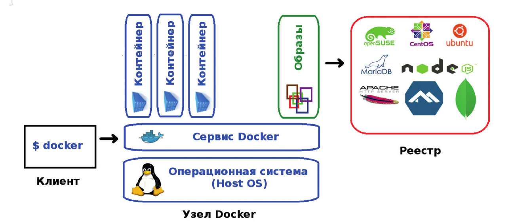
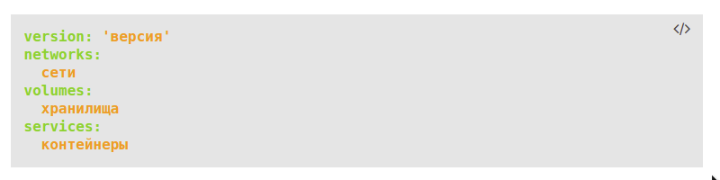
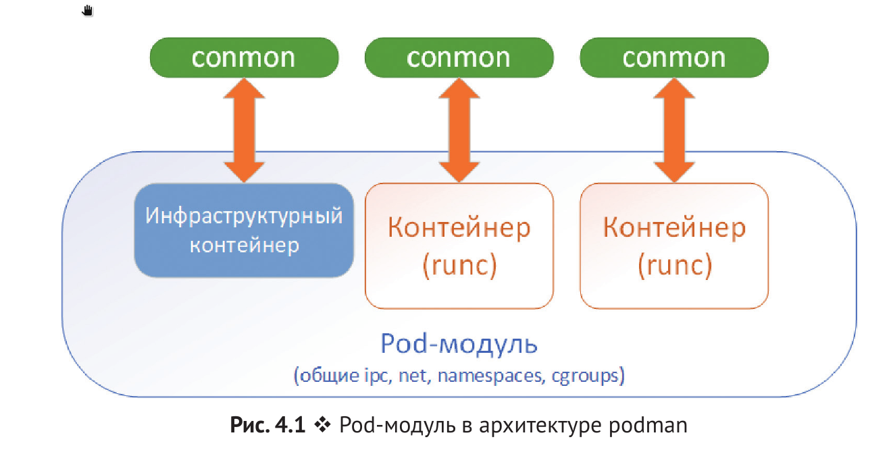

##Контейнеризация. Docker, Dockerfile, podman-compose

### 1. Домашнее задание по теме "Контейнеризация. Docker, Dockerfile"

1. Для создания образа, из которого в последствии будем разворачивать контейнеры, используем Dockerfile:

        1  FROM alpine:3.12
        2  MAINTAINER Andrey Shumeyko aka Dancer76 <a_shu@inbox.ru>
        3  RUN apk update
        4  RUN apk add --no-cache curl && apk add nginx && mkdir -p /run/nginx
        5  EXPOSE 80
        6  ADD /docfile/index.html /usr/share/nginx/html/
        7  ADD /docfile/default.conf /etc/nginx/conf.d/
        8  ENTRYPOINT [ "/usr/sbin/nginx", "-g", "daemon off;" ]

по умолчанию, будет стартовать контейнер с запускаемым nginx-ом, на порту 80.

Создадим контейнер с работающим nginx-ом, пробросив порт контейнера 80, на внешний хост - порт 8080

      docker run -d --rm -p 8080:80 --name nginx_alpine dancer76/alpine_nginx:1.0

строка 4 - создадим дополнительно каталог /run/nginx, для старта nginx-a  
строка 6 - добавим свой index.html файл  
строка 7 - заменим дефолтный конфиг, на свой, где прописан путь к index.html  

В Vagrantfile настроена внешняя сеть 192.168.10.11, можно подключится с основного хостового компа, где тоже создатся интерфейс из этой же сети.

2. Отправить полученный образ в репозиторий

Залогинеться на нужном(docker.io) репозитории хранения images:

      docker login docker.io    

по умолчанию centos7 логинется на registry.access.redhat.com, с кредами от docker hub-a

Залить собранный образ на docker hub:

      docker push dancer76/alpine_nginx:1.0

___

#   2. Общая теория, примеры, полезности.

Основные компоненты Docker:
- контейнеры – изолированные при помощи технологий операционной системы пользовательские окружения, в которых выполняются приложения. Проще всего дать определение контейнеру Docker как запущенному из образа приложению. Кстати, именно этим идеологически и отличаетсяDocker, например, от LXC (Linux Containers), хотя они используют одни и те же технологии ядра Linux. Разработчики проекта Docker исповедуют принцип: **один контейнер – это одно приложение !!!!**;

- образы – доступные только для чтения шаблоны приложений. Поверх существующих образов могут добавлятьсяновые уровни образов, которые совместно представляют­ айловую систему, изменяя или дополняя предыдущий уровень. Обычно новый образ создается либо при помощи сохранения уже запущенного контейнера в новый образ поверхсущест­вующего, либо при помощи специальных инструкцийдля утилиты Dockerfile. Для разделения различных уровней контейнера на уровне файловой системы могут использоваться UnionFS, aufs, btrfs, vfs, OverlayFS и Device Mapper;

- реестры (registry), содержащие репозитории (repository) образов, – сетевые хранилища образов. Могут быть как приватными, так и общедоступными. Самым известным реестромявляется Docker Hub.

Для изоляции контейнеров и обеспечения безопасности в операционных системах GNU/Linux используются стандартные технологии ядра Linux, такие как:
- пространства имен (Linux Namespaces);
- контрольные группы (cgroups);
- средства управления привилегиями (Linux Capabilities);
- дополнительные, мандатные системы обеспечения безопасности, такие как SELinux.

___

>**SELinux**
Для того чтобы контейнер или виртуальная машина получила дос­туп к файловой ситеме хоста, нужно задать правильный тип для соответ­ствующих файлов и директорий:  

      chcon -R -t container_file_t ./test
>изменить разрешение на папку, если пробрасываем содержимое с хостовой системы внутрь контейнера.

___

- **docker search <имя образа>** - найти образ на Docker Hub
- **docker pull <имя образа>** - скачать образ
- **docker images** - просмотреть список скачанных образов, находящихся в локально.
- **docker rmi**    - удалить все имеющиеся в локальном кеше образы
- **docker run --rm -it  -e MYSQL_ROOT_PASSWORD=docker --name <произвольное имя контейнера> <имя образа>** - запуск образа
- **docker run -d -e MYSQL_ROOT_PASSWORD=docker** - запуск контейнера в неинтерактивном режиме

      -i - контейнер должен запус­титься в интерактивном режиме
      -t - должен быть выделен псевдотерминал
      -e -  задает переменные окружения в контейнере
      -d - отсоеденить контейнер
      -v - подключить папку или файл с хоста внутрь контейнера (-v /home/andrey:/usr/local/apache2/ - папку  "/home/andrey" с хост системы, пробрасываем в контейнер по пути "/usr/local/apache2/" )
      -p - перенаправить порт с хост системы на порт контейнера ( -p 8888:80 порт "8888" с хоста перенаправляем на "80" порт контейнера)
      --rm - удалить контейнер по завершению его работы

- **docker exec -it <имя контейнера> <bash - программа внутри контейнера>** -  подключиться к работающему контейнеру
- **docker ps**  - посмотреть список запущенных контейнеров
- **docker logs <имя контейнера>** - просмотр логов запуска контейнеров
- **docker build -t <имя:тэг> <директория>**
- **docker start** - запустить остановленный контейнер

      -a --attach - подключить стандартный вывод и ошибки контейнера, на хост. (вывести на хосте результат запуска программы в контейнере)

- **docker diff <имя контейнера>** - показать все изменения в контейнере, по сравнению с исходным образом
- **docker commit -m "message commit" -a "who made"  <имя контейнера>** - создать новый образ на основе работающего контейнера со всеми изменениями

      -m - описание
      -а - автор

- **docker tag образ[:тег] [сервер][имя пользователя]имя[:тег]** - публикация образа в реестр,  используя по умолчанию Docker Hub
- **docker login** - подключится к  Docker Hub
- **docker push <имя образа>** - опубликовать  образ

- **docker history <имя образа>** - посмотреть созданные слои файловой системы образа
- **docker export -o <name>.tar <имя контейнера>** - экпортировать контейнер в tar архив.
- **docker import <name>.tar <test:1.0>** - импортируем полученный образ <name>.tar под именем <test:1.0>

    >Фактически tar-архив представляет собой полный слепок файловой системы контейнера. Метаданные (слои) будут отсутствовать, при просмотре командой  **docker history <test:1.0>**

- **docker save -o <name>.tar <имя контейнера>** - сохранение образа контейнера
- **docker load -i <name>.tar** - загрузка сохранённого образа, все метаданные (имя образа, теги) и слои хранятся в архиве, при просмотре командой  **docker history <имя контейнера>** все слои будут на месте

#####Подключение к контейнеру постоянного хранилища:

**docker run --name storage -v /home/andrey/mywww:/usr/local/apache2/htdocs/ httpd echo test** - создадим остановленный контейнер, тома которого будут смонтированы в другой контейнер  

**docker run -d -p 8888:80 --volumes-from storage httpd** - новый контейнер с проброшенным томом из контейнера "storage", текущий контейнер можно удалять создавать сколько нужно раз.

### docker файл

Пример файла:

1. FROM centos:7
2. MAINTAINER The CentOS Project <cloud-ops@centos.org>
3. LABEL Vendor="CentOS" \
4. License=GPLv2 \
5. Version=2.4.6-40
6. RUN yum -y --setopt=tsflags=nodocs update && \
7. yum -y --setopt=tsflags=nodocs install httpd && \
8. yum clean all
9. EXPOSE 80              <---- указывает, что наш сервис использует порт 80, эта инструкция на самом деле не делает данный порт доступным хосту. Инструкция задает метаданные образа, указывающие, какой порт слушает контейнер. При запуске контейнера из этого образа, можно указать ключь "-Р" и тогда docker сам назначит порт на хостовой машине, который будет привязан к объявленному порту в контейнере. И также это запись объявляет порт для межконтейнерных связей("The EXPOSE instruction exposes the specified port and makes it available only for inter-container communication.") [Разъяснение expose инструкции](https://we-are.bookmyshow.com/understanding-expose-in-dockerfile-266938b6a33d)
10. ADD run-httpd.sh /run-httpd.sh
11. RUN chmod -v +x /run-httpd.sh
12. CMD ["/run-httpd.sh"]

со 2 по 5 строки  приведены метаданные,
2 - указывается имя и электронный адрес создателя образа
3-5 - представляют собой **_одну_** инструкцию LABEL, в которой указаны вендор,лицензия и версия
6-8 - **_одна_** инструкция RUN для обновления пакетов, установки пакета httpd, очистки кэша для уменьшения размера. tsflags=nodocs - говорит yum-у не ставить пакеты с документацией.
10 - добавляем в создаваемый образ, в данном случае файл, но можно добавить и папку.  **_То, что добавляем, должно находиться в той же директории, что и сам Dockerfile_**
11 - устанавливает исполнимый бит на добавленный файл
12 -  указан аргумент для ENTRYPOINT. Поскольку ENTRYPOINT запись отсутствует, то при старте контейнера из образа будет выполнена команда:

    /bin/sh -c /run-httpd.sh

___

**_CMD_** или **_ENTRYPOINT_** - по отдельности работают одинаково, запускают выранное приложение, команду и т.д

могут работать в двух режимах запуска:

**SHELL**

    FROM centos
    ENTRYPOINT ping 8.8.8.8 <---- запускается процесс шелл (bash, sh, fish) и в нём стартует команда "ping 8.8.8.8". Т.е. будет 2 процесса в контейнере

**EXEC**

    FROM centos
    ENTRYPOINT ["ping" "8.8.8.8"]  <---- запускается непосредственно сама команда  "ping 8.8.8.8". Т.е. будет 1 процесс в контейнере

**Файл может содержать только одну инструкцию ENTRYPOINT**. Существует также инструкция CMD, которая передает аргументы в инструкцию ENTRYPOINT. Если в файле более одной инструкции CMD, то применяется только послед­няя. Также можно обойтись и без ENTRYPOINT, только используя CMD, **поскольку значение ENTRYPOINT по умолчанию – это /bin/sh -c**

- Для варианта с ENTRYPOINT (CMD передает аргументы в инструкцию ENTRYPOINT):

      CMD ["параметр1", "параметр2"]

- Запуска веб-сервера как демона в контейнере, инструкция ENTRYPOINT не задана:

      CMD ["httpd", "-D", "FOREGROUND"]

___

### podman-compose (docker-compose)
podman(docker)-compose.yaml. Именно в этом файле настраиваются контейнеры, которые надо создать для проекта, потом они будут созданы автоматически с помощью podman(docker)-compose. Файл использует синтаксис YAML и должен содержать такие данные:

### Запуск pod-модулей при помощи podman
Концепция pod-модулей впервые была введена проектом Kubernetes, и pod-модули в podman очень на них похожи. _**Pod-модуль – это группа, состоящая из одного или более контейнеров, которые используют общее пространство имен, сеть и тома. Pod-модуль можно рассматривать как «логический сервер».**_

